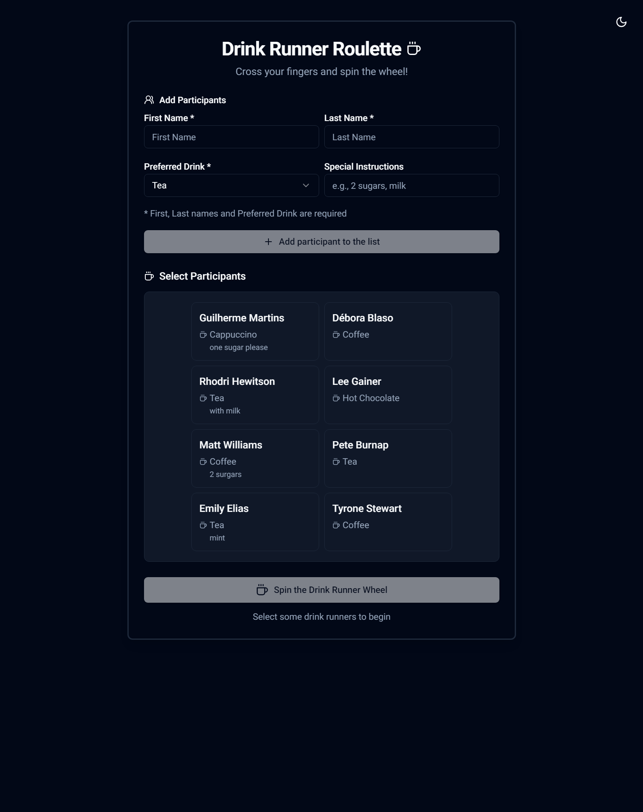
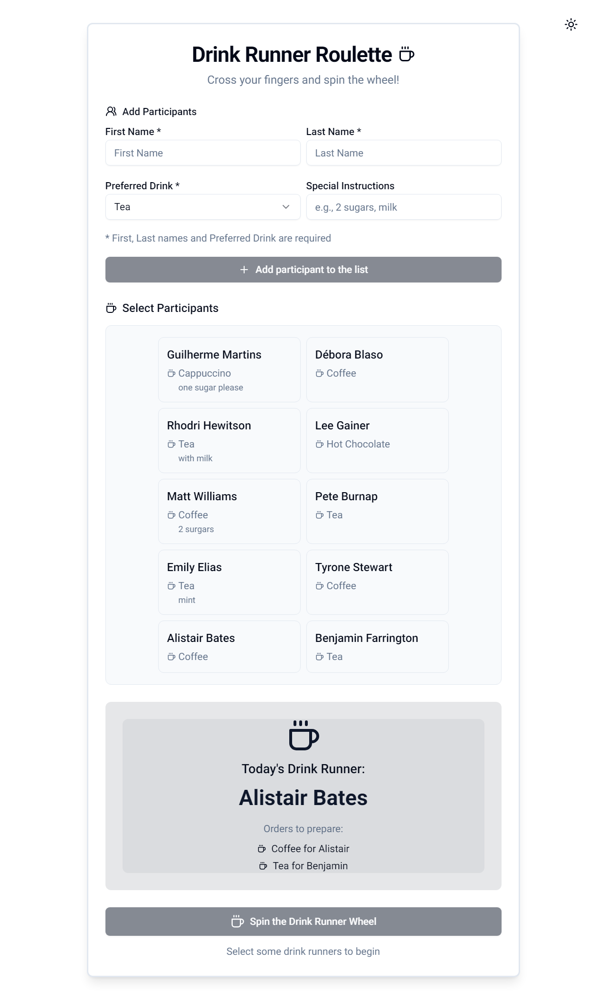
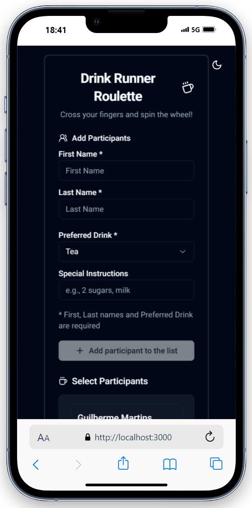
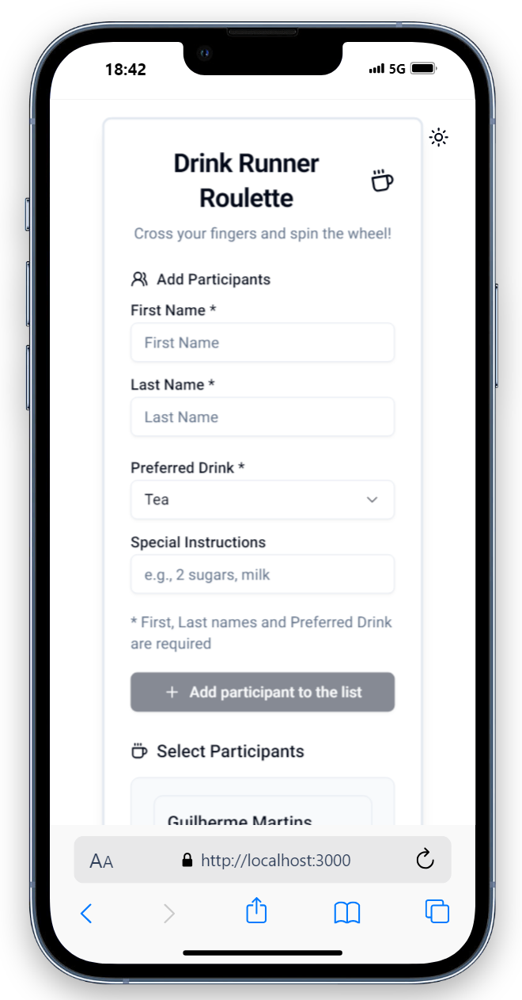

# Drink Runner Roulette 🍵

Ever had that awkward moment in the office when everyone's craving a drink, but no one wants to make it? Drink Runner Roulette is here to save the day!
It's a fun, fair, and simple web app that randomly picks who's making the next round of drinks.

## What's This All About? 🤔

You know how it goes - it's always the same people volunteering to make drinks, while others mysteriously disappear when it's drinks time. Drink Runner Roulette brings some easy way and fairness to the age-old office drink round by:

- 🎲 Randomly selecting who makes the drinks
- 👥 Letting you add or remove people easily
- 📱 Working on any device (phones, tablets, computers)
- ⚡ Being super quick and easy to use

## Features

- ✨ Dynamic participant management
  - Add/remove participants with real-time API sync
  - Clear all participants at once
  - Automatic name parsing (first name + last name)
  - Real-time list updates
- 🎲 Random selection via API
  - Fair selection algorithm
  - Animated result announcement
  - Minimum 2 participants required
  - Persistent user records
- 🎨 Modern UI/UX
  - Dark/Light theme support
  - Responsive design
  - Interactive hover effects
  - Toast notifications
  - Loading states & animations
  - Accessible components
- 💫 Visual Feedback
  - Success/Error notifications
  - Loading indicators
  - Hover animations
  - Theme transitions
- 🔧 Error Handling
  - API error boundaries
  - Graceful fallbacks
  - User-friendly error messages
  - Automatic retries

## Demo

<p  align="center">
  <h5 align="center">🖥 Desktop:</h5>
  <kbd>

</kbd>
  <kbd>

</kbd>
</p>
  <h5 align="center">📱 Mobile:</h5>
<p  align="center">
<kbd>

</kbd>
<kbd>

</kbd>
</p>

- 💻 See more screenshots [here](https://github.com/gmartins-dev/tea-roulette/tree/master/public/demo)

## Tech Stack

- **Framework**: [Next.js 14](https://nextjs.org/) (React Framework)
- **Language**: [TypeScript](https://www.typescriptlang.org/)
- **API Integration**: C# .NET API
- **Styling & Components**:
  - [Tailwind CSS](https://tailwindcss.com/) for utility-first CSS
  - [shadcn/ui](https://ui.shadcn.com/) - A collection of re-usable components
  - [Lucide Icons](https://lucide.dev/) for icons
- **Theme**: [next-themes](https://github.com/pacocoursey/next-themes)
- **Font**: [Roboto](https://fonts.google.com/specimen/Roboto)

## Getting Started

1. **Prerequisites**
   - Node.js 18.x or later
   - Docker and Docker Compose
   - npm 9.x or later

2. **Installation**
   ```bash
   # Clone the repository
   git clone https://github.com/gmartins-dev/tea-roulette
   cd tea-roulette

   # Install dependencies
   npm install

   # Start the API (in docker directory)
   cd docker
   docker compose up -d

   # Create .env.local in root directory
   echo "NEXT_PUBLIC_API_URL=http://localhost:8794" > .env.local

   # Start the frontend
   npm run dev
   ```

3. **Open** `http://localhost:3000` in your browser

## Project Structure

```
tea-roulette/
├── app/                          # Main application files
│   ├── api/                      # API routes and handlers
│   ├── layout.tsx                # Main layout component
│   └── page.tsx                  # Main page component
├── components/                   # Reusable UI components
│   ├── add-user-form.tsx         # Form for adding users
│   ├── drink-order-form.tsx      # Form for drink orders
│   └── ui/                       # UI components (buttons, inputs, etc.)
├── docker/                       # Docker configuration files
│   └── docker-compose.yml        # Docker Compose file
├── lib/                          # Utility functions and helpers
│   └── api-handler.ts            # API handler utility
├── styles/                       # Global styles
│   └── globals.css               # Global CSS styles
├── tests/                        # Test files
├── .env.local                    # Local environment variables
├── package.json                  # Project metadata and dependencies
└── tsconfig.json                 # TypeScript configuration
```

## Development Guidelines

1. **Code Style**
   - TypeScript best practices
   - Functional components
   - Proper error handling
   - Meaningful component props

2. **API Integration**
   - Proper error handling
   - Loading states
   - Retry logic
   - Type safety

3. **State Management**
   - React hooks for local state
   - Error boundaries
   - Loading states
   - Side effects management

4. **Theme Support**
   - Dark/light mode
   - CSS variables
   - Smooth transitions
   - Consistent palette

## API Integration

The application integrates with the your own API, which provides:
- User management
- Random drink runnner selection
- Drink run tracking
- Persistent data storage

## Error Handling

The application includes comprehensive error handling:
- API error boundaries
- User-friendly error messages
- Automatic retries for failed requests
- Loading states for all async operations

## Testing

The Tea Roulette application includes comprehensive unit tests covering all major functionality. The tests are written using Jest and can be found in the `tests` directory.

### Test Coverage

The test suite covers the following areas:
- Random tea selection
- Tea collection management (adding/removing teas)
- Tea categorization and filtering
- User preferences handling
- History tracking
- Input validation

### Running Tests

To run the test suite:

```bash
npm test
```

To run tests with coverage report:

```bash
npm test -- --coverage
```

### Test Structure

The tests are organized into the following test suites:
- Core functionality tests
- Tea Management tests
- Tea Categories tests
- User Preferences tests
- History Tracking tests
- Validation tests
